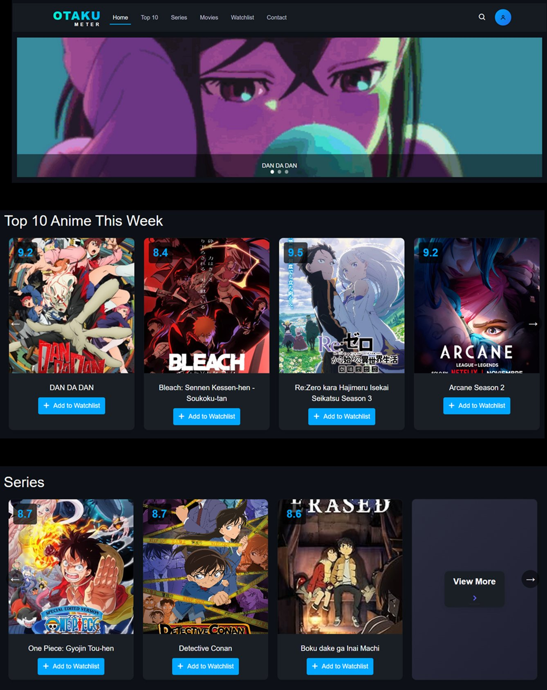
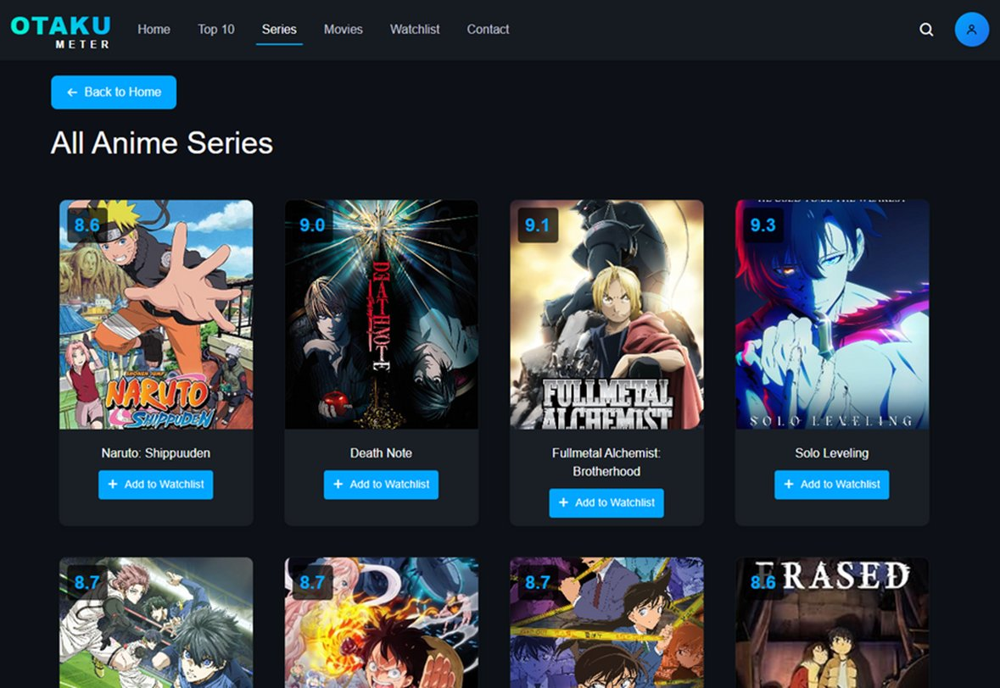

# 🎌 OtakuMeter — Anime Tracking & Rating Web Application

> A user-friendly website designed for anime fans to explore, track, rate, and engage with their favorite anime content — all in one place.

---

## 📌 Table of Contents

- [Project Overview](#-project-overview)
- [Screenshots](#-screenshots)
- [Features](#-features)
- [Pages & Sections](#-pages--sections)
- [Technologies Used](#-technologies-used)
- [Team](#-team)

---

## 📖 Project Overview

**OtakuMeter** is a full-featured anime web application that allows users to:

- 🔍 **Explore** anime series and movies with ratings and details
- 📋 **Track** their personal watchlist with real-time updates
- ⭐ **Rate** anime on a 10-star scale and leave comments
- 🏆 **Discover** the Top 10 anime of the week
- 👤 **Manage** their profile with secure authentication

Whether you're looking for a new anime to watch, want to keep your watchlist organized, or share your thoughts through ratings and comments — OtakuMeter provides all these features in one place.

---

## 📸 Screenshots

### 🏠 Home Page
Featured anime banner, Top 10 of the week, latest series & movies, and category browsing.



---

### 📺 All Anime Series
Browse the full series library with ratings, category tags, and quick-add watchlist buttons.



---

## 🌟 Features

### 🔐 User Authentication System
- User registration with full input validation
- Secure login system
- Password hashing for security
- Profile update functionality
- Descriptive error handling and user feedback

### 🔎 Navigation & Search
- **Navigation Menu:** Home | Top 10 | Series | Movies | Watchlist | Contact
- **User Profile:** View info, Logout
- **Search:** Toggle bar, clear input, real-time filtering

### 🏠 Home Page Sections

| Section | Description |
|---------|-------------|
| 🎬 Featured Anime | Large banner with title overlay highlighting a featured anime |
| 🏆 Top 10 This Week | Highest-rated anime with thumbnails, scores & watchlist buttons |
| 📺 Latest Series | Newly updated series cards with scores & watchlist |
| 🎥 Movies | Latest movie cards in consistent design |
| 🗂️ Browse by Categories | Explore by type — Series or Movies — with "View More" card |

### 📋 Watchlist Functions
- Personal anime collection management
- Add / Remove functionality
- Real-time updates without page reload
- Empty state handling
- Status tracking

### 🎴 Anime Detail Card
Each anime page shows:
- Title, genre, description, status, start year, episode count
- Trailer link
- Average user rating
- Quick "Add to Watchlist" button

### ⭐ Ratings & Comments
- 10-star rating system
- Comment submission
- Average rating calculation across all users
- Comment deletion
- Timestamp display on all comments

### 📺 Series & Movies Pages
- Organized grid layout
- Detailed anime cards with ratings
- Add to Watchlist directly from the card
- Modal information view
- Back to Home navigation

### 🔗 Footer
- Social media links
- Site navigation links
- Copyright information
- Contact details

---

## 🗂️ Pages & Sections

```
OtakuMeter/
├── Home          → Featured banner + Top 10 + Series + Movies + Categories
├── Top 10        → Weekly ranked anime list
├── Series        → Full series library with ratings & watchlist
├── Movies        → Full movies library with ratings & watchlist
├── Watchlist     → Personal tracked anime collection
└── Contact       → Footer with links & social media
```

---

## 🛠️ Technologies Used

| Layer | Technology |
|-------|-----------|
| Frontend | HTML, CSS, JavaScript |
| Backend | PHP / Node.js |
| Database | MySQL / Firebase |
| Authentication | Session-based login, password hashing |
| Real-Time | Dynamic DOM updates (watchlist, search) |

---

## 👥 Team

| Name | ID |
|------|----|
| Jana Mufti | S21106991 |
| Afnan Kamel | S22208066 |
| Aya Mohammed | S21207588 |
| Afrah Bashaddadah | S22107697 |

**Supervised by:** Dr. Mohammad Nauman  
**Course:** CS2111
